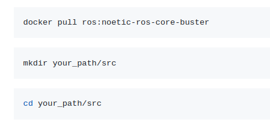
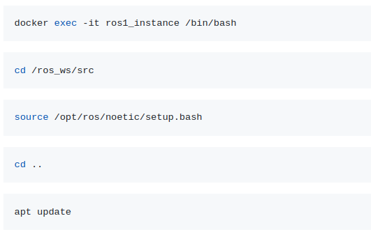
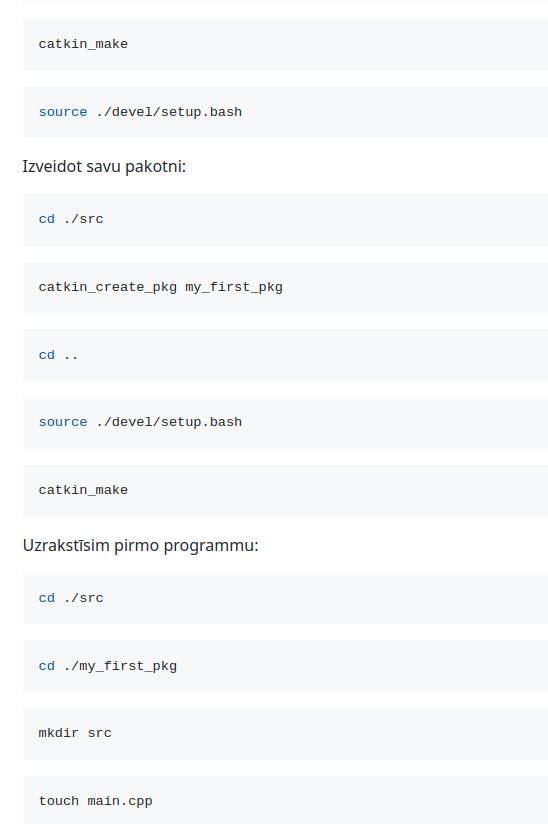

# ROS1 praktiskā nodarbība.

### Datora sagatavošana darbam 
1. Docker Desktop instalācija. 
2. Visual Studio Code instalācija, vai Notepad++.

### ROS1 docker image konteinera palaišana 

Palaišana ar nosacījumu kā datora lokālā direktorija ir koplietota ar konteinera workspace/src mapi.



Run container (Linux/Mac):

```bash 
docker run -d -it --name ros1_instance --mount type=bind,source="$(pwd)",target=/ros_ws/src ros:noetic-ros-core-buster /bin/bash
```

or

Run container (Windows):

```bash 
docker run -d -it --name ros1_instance --mount type=bind,source="${pwd}",target=/ros_ws/src ros:noetic-ros-core-buster /bin/bash
```

Pievienoties konteinerim




```bash  
apt install python3-rosdep-modules python3-rosinstall-generator python3-vcstools python3-vcstool build-essential -y
```


### Write your first code for ROS EDIT main.cpp by using your editor:

```cpp
#include <ros/ros.h>

int main(int argc, char** argv)

{

// Initialize a ROS node

ros::init(argc, argv, "my_first_ros_node");

// Create a ROS NodeHandle object

ros::NodeHandle n;

// wait until ROS is OK

while (ros::ok()) {

// Handle ROS communication events

ros::spinOnce();

ROS_INFO_ONCE( "My node is running" );

}

return 0;

}
```


### EDIT CMAKELISTS package file:

```
cmake_minimum_required(VERSION 3.0.2)

project(my_first_pkg)

## Compile as C++11, supported in ROS Kinetic and newer

add_compile_options(-std=c++11)

## Find catkin macros and libraries
## if COMPONENTS list like find_package(catkin REQUIRED COMPONENTS xyz)
## is used, also find other catkin packages

find_package(catkin REQUIRED COMPONENTS roscpp)

## System dependencies are found with CMake's conventions
# find_package(Boost REQUIRED COMPONENTS system)
## Uncomment this if the package has a setup.py. This macro ensures
## modules and global scripts declared therein get installed
## See http://ros.org/doc/api/catkin/html/user_guide/setup_dot_py.html
# catkin_python_setup()

################################################
## Declare ROS messages, services and actions ##
################################################

## To declare and build messages, services or actions from within this
## package, follow these steps:
## * Let MSG_DEP_SET be the set of packages whose message types you use in
## your messages/services/actions (e.g. std_msgs, actionlib_msgs, ...).
## * In the file package.xml:
## * add a build_depend tag for "message_generation"
## * add a build_depend and a exec_depend tag for each package in MSG_DEP_SET
## * If MSG_DEP_SET isn't empty the following dependency has been pulled in
## but can be declared for certainty nonetheless:
## * add a exec_depend tag for "message_runtime"
## * In this file (CMakeLists.txt):
## * add "message_generation" and every package in MSG_DEP_SET to
## find_package(catkin REQUIRED COMPONENTS ...)
## * add "message_runtime" and every package in MSG_DEP_SET to
## catkin_package(CATKIN_DEPENDS ...)
## * uncomment the add_*_files sections below as needed
## and list every .msg/.srv/.action file to be processed
## * uncomment the generate_messages entry below
## * add every package in MSG_DEP_SET to generate_messages(DEPENDENCIES ...)

## Generate messages in the 'msg' folder
# add_message_files(
# FILES
# Message1.msg
# Message2.msg
# )

## Generate services in the 'srv' folder
# add_service_files(
# FILES
# Service1.srv
# Service2.srv
# )

## Generate actions in the 'action' folder
# add_action_files(
# FILES
# Action1.action
# Action2.action
# )

## Generate added messages and services with any dependencies listed here
# generate_messages(
# DEPENDENCIES
# std_msgs # Or other packages containing msgs
# )

################################################
## Declare ROS dynamic reconfigure parameters ##
################################################

## To declare and build dynamic reconfigure parameters within this
## package, follow these steps:
## * In the file package.xml:
## * add a build_depend and a exec_depend tag for "dynamic_reconfigure"
## * In this file (CMakeLists.txt):
## * add "dynamic_reconfigure" to
## find_package(catkin REQUIRED COMPONENTS ...)
## * uncomment the "generate_dynamic_reconfigure_options" section below
## and list every .cfg file to be processed
## Generate dynamic reconfigure parameters in the 'cfg' folder
# generate_dynamic_reconfigure_options(
# cfg/DynReconf1.cfg
# cfg/DynReconf2.cfg
# )

###################################
## catkin specific configuration ##
###################################

## The catkin_package macro generates cmake config files for your package
## Declare things to be passed to dependent projects
## INCLUDE_DIRS: uncomment this if your package contains header files
## LIBRARIES: libraries you create in this project that dependent projects also need
## CATKIN_DEPENDS: catkin_packages dependent projects also need
## DEPENDS: system dependencies of this project that dependent projects also need

catkin_package(
# INCLUDE_DIRS include
# LIBRARIES my_first_pkg
# CATKIN_DEPENDS other_catkin_pkg
# DEPENDS system_lib
)

###########
## Build ##
###########

## Specify additional locations of header files
## Your package locations should be listed before other locations
include_directories(
# include
${catkin_INCLUDE_DIRS}
)

## Declare a C++ library
# add_library(${PROJECT_NAME}
# src/${PROJECT_NAME}/my_first_pkg.cpp
# )

## Add cmake target dependencies of the library
## as an example, code may need to be generated before libraries
## either from message generation or dynamic reconfigure
# add_dependencies(${PROJECT_NAME} ${${PROJECT_NAME}_EXPORTED_TARGETS} ${catkin_EXPORTED_TARGETS})
## Declare a C++ executable
## With catkin_make all packages are built within a single CMake context
## The recommended prefix ensures that target names across packages don't collide
add_executable(${PROJECT_NAME}_node src/main.cpp)
## Rename C++ executable without prefix
## The above recommended prefix causes long target names, the following renames the
## target back to the shorter version for ease of user use
## e.g. "rosrun someones_pkg node" instead of "rosrun someones_pkg someones_pkg_node"
# set_target_properties(${PROJECT_NAME}_node PROPERTIES OUTPUT_NAME node PREFIX "")
## Add cmake target dependencies of the executable
## same as for the library above
add_dependencies(${PROJECT_NAME}_node ${${PROJECT_NAME}_EXPORTED_TARGETS} ${catkin_EXPORTED_TARGETS})
## Specify libraries to link a library or executable target against
target_link_libraries(${PROJECT_NAME}_node
${catkin_LIBRARIES}
)

#############
## Install ##
#############

# all install targets should use catkin DESTINATION variables
# See http://ros.org/doc/api/catkin/html/adv_user_guide/variables.html
## Mark executable scripts (Python etc.) for installation
## in contrast to setup.py, you can choose the destination
# catkin_install_python(PROGRAMS
# scripts/my_python_script
# DESTINATION ${CATKIN_PACKAGE_BIN_DESTINATION}
# )

## Mark executables for installation
## See http://docs.ros.org/melodic/api/catkin/html/howto/format1/building_executables.html
# install(TARGETS ${PROJECT_NAME}_node
# RUNTIME DESTINATION ${CATKIN_PACKAGE_BIN_DESTINATION}
# )
## Mark libraries for installation
## See http://docs.ros.org/melodic/api/catkin/html/howto/format1/building_libraries.html
# install(TARGETS ${PROJECT_NAME}
# ARCHIVE DESTINATION ${CATKIN_PACKAGE_LIB_DESTINATION}
# LIBRARY DESTINATION ${CATKIN_PACKAGE_LIB_DESTINATION}
# RUNTIME DESTINATION ${CATKIN_GLOBAL_BIN_DESTINATION}
# )
## Mark cpp header files for installation
# install(DIRECTORY include/${PROJECT_NAME}/
# DESTINATION ${CATKIN_PACKAGE_INCLUDE_DESTINATION}
# FILES_MATCHING PATTERN "*.h"
# PATTERN ".svn" EXCLUDE
# )

## Mark other files for installation (e.g. launch and bag files, etc.)
# install(FILES
# # myfile1
# # myfile2
# DESTINATION ${CATKIN_PACKAGE_SHARE_DESTINATION}
# )

#############
## Testing ##
#############

## Add gtest based cpp test target and link libraries
# catkin_add_gtest(${PROJECT_NAME}-test test/test_my_first_pkg.cpp)
# if(TARGET ${PROJECT_NAME}-test)
# target_link_libraries(${PROJECT_NAME}-test ${PROJECT_NAME})
# endif()
## Add folders to be run by python nosetests
# catkin_add_nosetests(test)
```

### EDIT package.xml file:

```xml
<?xml version="1.0"?>
<package format="2">
<name>my_first_pkg</name>
<version>0.0.0</version>
<description>The my_first_pkg package</description>

<!-- One maintainer tag required, multiple allowed, one person per tag -->
<!-- Example: -->
<!-- <maintainer email="jane.doe@example.com">Jane Doe</maintainer> -->
<maintainer email="root@todo.todo">root</maintainer>


<!-- One license tag required, multiple allowed, one license per tag -->
<!-- Commonly used license strings: -->
<!-- BSD, MIT, Boost Software License, GPLv2, GPLv3, LGPLv2.1, LGPLv3 -->
<license>TODO</license>


<!-- Url tags are optional, but multiple are allowed, one per tag -->
<!-- Optional attribute type can be: website, bugtracker, or repository -->
<!-- Example: -->
<!-- <url type="website">http://wiki.ros.org/my_first_pkg</url> -->


<!-- Author tags are optional, multiple are allowed, one per tag -->
<!-- Authors do not have to be maintainers, but could be -->
<!-- Example: -->
<!-- <author email="jane.doe@example.com">Jane Doe</author> -->


<!-- The *depend tags are used to specify dependencies -->
<!-- Dependencies can be catkin packages or system dependencies -->
<!-- Examples: -->
<!-- Use depend as a shortcut for packages that are both build and exec dependencies -->
<!-- <depend>roscpp</depend> -->
<!-- Note that this is equivalent to the following: -->
<!-- <build_depend>roscpp</build_depend> -->
<!-- <exec_depend>roscpp</exec_depend> -->
<!-- Use build_depend for packages you need at compile time: -->
<!-- <build_depend>message_generation</build_depend> -->
<!-- Use build_export_depend for packages you need in order to build against this package: -->
<!-- <build_export_depend>message_generation</build_export_depend> -->
<!-- Use buildtool_depend for build tool packages: -->
<!-- <buildtool_depend>catkin</buildtool_depend> -->
<!-- Use exec_depend for packages you need at runtime: -->
<!-- <exec_depend>message_runtime</exec_depend> -->
<!-- Use test_depend for packages you need only for testing: -->
<!-- <test_depend>gtest</test_depend> -->
<!-- Use doc_depend for packages you need only for building documentation: -->
<!-- <doc_depend>doxygen</doc_depend> -->
<buildtool_depend>catkin</buildtool_depend>


<build_depend>roscpp</build_depend>
<exec_depend>roscpp</exec_depend>


<!-- The export tag contains other, unspecified, tags -->
<export>
<!-- Other tools can request additional information be placed here -->

</export>
</package>
```

### Compile the project from the workspace directory:

```bash
catkin_make
```


### RUN the new package node:

Open a new terminal for the docker container:

```bash
docker exec -it ros1_instance /bin/bash
```

```bash
cd /ros_ws
```

```bash
source ./devel/setup.bash
```

Run ROS CORE:
```bash
roscore
```

Return back to the previous terminal:

```bash
rosrun my_first_pkg my_first_pkg_node
```

Create the third terminal

```bash
docker exec -it ros1_instance /bin/bash
```

```bash
cd /ros_ws
```

```bash
source ./devel/setup.bash
```


Check the our node is running:

```bash
rosnode list
```

```bash
rosnode info /my_first_ros_node
```

### Subscribing ROS topics (messages)


Install dependences
```bash
apt install ros-noetic-turtlesim
```

Run TurtleSim Teleop node:
```bash
rosrun turtlesim turtle_teleop_key
```

In the third terminal list available topics:
```bash
rostopic list
```

Get the topic content:
```bash
rostopic echo /turtle1/cmd_vel
```

Return to the prev.terminal and play with keyboard arrows…

### Modify your package main.cpp file.

Define the class
```
class My_subscriber

{

public:

My_subscriber(ros::NodeHandle* nh) { // the class's constructor

nh_ = nh;

sub_ = nh_->subscribe("/cmd", 100, &My_subscriber::topic_callback, this);

ROS_INFO( "My_subscriber is listening /cmd topic" );

}

private:

void topic_callback(const geometry_msgs::Twist::Ptr msg) {

// Printing out the message content

ROS_INFO_STREAM( "Catch message: linear.x=" << msg->linear.x <<

", linear.y="<< msg->linear.y <<

", linear.z="<< msg->linear.z <<

", angular.x="<< msg->angular.x <<

", angular.y="<< msg->angular.y <<

", angular.z="<< msg->angular.z);

}

ros::Subscriber sub_;

ros::NodeHandle* nh_;

};

Use additional include:

#include <geometry_msgs/Twist.h>

Full source of the main.cpp

#include <ros/ros.h>

#include <geometry_msgs/Twist.h>

class My_subscriber

{

public:

My_subscriber(ros::NodeHandle* nh) { // the class's constructor

nh_ = nh;

sub_ = nh_->subscribe("/cmd", 100, &My_subscriber::topic_callback, this);

ROS_INFO( "My_subscriber is listening /cmd topic" );

}

private:

void topic_callback(const geometry_msgs::Twist::Ptr msg) {

// Printing out the message content

ROS_INFO_STREAM( "Catch message: linear.x=" << msg->linear.x <<

", linear.y="<< msg->linear.y <<

", linear.z="<< msg->linear.z <<

", angular.x="<< msg->angular.x <<

", angular.y="<< msg->angular.y <<

", angular.z="<< msg->angular.z);

}

ros::Subscriber sub_;

ros::NodeHandle* nh_;

};

int main(int argc, char** argv)

{

// Initialize a ROS node

ros::init(argc, argv, "my_first_ros_node");

// Create a ROS NodeHandle object

ros::NodeHandle n;

// Create our class's instance

My_subscriber topic_subscr(&n);

// wait until ROS is OK

while (ros::ok()) {

// Handle ROS communication events

ros::spinOnce();

ROS_INFO_ONCE( "My node is running" );

}

return 0;

}
```

### Modify the CMAKELIST file of the package


cmake_minimum_required(VERSION 3.0.2)

project(my_first_pkg)

## Compile as C++11, supported in ROS Kinetic and newer

add_compile_options(-std=c++11)

## Find catkin macros and libraries

## if COMPONENTS list like find_package(catkin REQUIRED COMPONENTS xyz)

## is used, also find other catkin packages

find_package(catkin REQUIRED COMPONENTS roscpp geometry_msgs)

## System dependencies are found with CMake's conventions

# find_package(Boost REQUIRED COMPONENTS system)

## Uncomment this if the package has a setup.py. This macro ensures

## modules and global scripts declared therein get installed

## See http://ros.org/doc/api/catkin/html/user_guide/setup_dot_py.html

# catkin_python_setup()

################################################

## Declare ROS messages, services and actions ##

################################################

## To declare and build messages, services or actions from within this

## package, follow these steps:

## * Let MSG_DEP_SET be the set of packages whose message types you use in

## your messages/services/actions (e.g. std_msgs, actionlib_msgs, ...).

## * In the file package.xml:

## * add a build_depend tag for "message_generation"

## * add a build_depend and a exec_depend tag for each package in MSG_DEP_SET

## * If MSG_DEP_SET isn't empty the following dependency has been pulled in

## but can be declared for certainty nonetheless:

## * add a exec_depend tag for "message_runtime"

## * In this file (CMakeLists.txt):

## * add "message_generation" and every package in MSG_DEP_SET to

## find_package(catkin REQUIRED COMPONENTS ...)

## * add "message_runtime" and every package in MSG_DEP_SET to

## catkin_package(CATKIN_DEPENDS ...)

## * uncomment the add_*_files sections below as needed

## and list every .msg/.srv/.action file to be processed

## * uncomment the generate_messages entry below

## * add every package in MSG_DEP_SET to generate_messages(DEPENDENCIES ...)

## Generate messages in the 'msg' folder

# add_message_files(

# FILES

# Message1.msg

# Message2.msg

# )

## Generate services in the 'srv' folder

# add_service_files(

# FILES

# Service1.srv

# Service2.srv

# )

## Generate actions in the 'action' folder

# add_action_files(

# FILES

# Action1.action

# Action2.action

# )

## Generate added messages and services with any dependencies listed here

# generate_messages(

# DEPENDENCIES

# std_msgs # Or other packages containing msgs

# )

################################################

## Declare ROS dynamic reconfigure parameters ##

################################################

## To declare and build dynamic reconfigure parameters within this

## package, follow these steps:

## * In the file package.xml:

## * add a build_depend and a exec_depend tag for "dynamic_reconfigure"

## * In this file (CMakeLists.txt):

## * add "dynamic_reconfigure" to

## find_package(catkin REQUIRED COMPONENTS ...)

## * uncomment the "generate_dynamic_reconfigure_options" section below

## and list every .cfg file to be processed

## Generate dynamic reconfigure parameters in the 'cfg' folder

# generate_dynamic_reconfigure_options(

# cfg/DynReconf1.cfg

# cfg/DynReconf2.cfg

# )

###################################

## catkin specific configuration ##

###################################

## The catkin_package macro generates cmake config files for your package

## Declare things to be passed to dependent projects

## INCLUDE_DIRS: uncomment this if your package contains header files

## LIBRARIES: libraries you create in this project that dependent projects also need

## CATKIN_DEPENDS: catkin_packages dependent projects also need

## DEPENDS: system dependencies of this project that dependent projects also need

catkin_package(

# INCLUDE_DIRS include

# LIBRARIES my_first_pkg

# CATKIN_DEPENDS other_catkin_pkg

# DEPENDS system_lib

)

###########

## Build ##

###########

## Specify additional locations of header files

## Your package locations should be listed before other locations

include_directories(

# include

${catkin_INCLUDE_DIRS}

)

## Declare a C++ library

# add_library(${PROJECT_NAME}

# src/${PROJECT_NAME}/my_first_pkg.cpp

# )

## Add cmake target dependencies of the library

## as an example, code may need to be generated before libraries

## either from message generation or dynamic reconfigure

# add_dependencies(${PROJECT_NAME} ${${PROJECT_NAME}_EXPORTED_TARGETS} ${catkin_EXPORTED_TARGETS})

## Declare a C++ executable

## With catkin_make all packages are built within a single CMake context

## The recommended prefix ensures that target names across packages don't collide

add_executable(${PROJECT_NAME}_node src/main.cpp)

## Rename C++ executable without prefix

## The above recommended prefix causes long target names, the following renames the

## target back to the shorter version for ease of user use

## e.g. "rosrun someones_pkg node" instead of "rosrun someones_pkg someones_pkg_node"

# set_target_properties(${PROJECT_NAME}_node PROPERTIES OUTPUT_NAME node PREFIX "")

## Add cmake target dependencies of the executable

## same as for the library above

add_dependencies(${PROJECT_NAME}_node ${${PROJECT_NAME}_EXPORTED_TARGETS} ${catkin_EXPORTED_TARGETS})

## Specify libraries to link a library or executable target against

target_link_libraries(${PROJECT_NAME}_node

${catkin_LIBRARIES}

)

#############

## Install ##

#############

# all install targets should use catkin DESTINATION variables

# See http://ros.org/doc/api/catkin/html/adv_user_guide/variables.html

## Mark executable scripts (Python etc.) for installation

## in contrast to setup.py, you can choose the destination

# catkin_install_python(PROGRAMS

# scripts/my_python_script

# DESTINATION ${CATKIN_PACKAGE_BIN_DESTINATION}

# )

## Mark executables for installation

## See http://docs.ros.org/melodic/api/catkin/html/howto/format1/building_executables.html

# install(TARGETS ${PROJECT_NAME}_node

# RUNTIME DESTINATION ${CATKIN_PACKAGE_BIN_DESTINATION}

# )

## Mark libraries for installation

## See http://docs.ros.org/melodic/api/catkin/html/howto/format1/building_libraries.html

# install(TARGETS ${PROJECT_NAME}

# ARCHIVE DESTINATION ${CATKIN_PACKAGE_LIB_DESTINATION}

# LIBRARY DESTINATION ${CATKIN_PACKAGE_LIB_DESTINATION}

# RUNTIME DESTINATION ${CATKIN_GLOBAL_BIN_DESTINATION}

# )

## Mark cpp header files for installation

# install(DIRECTORY include/${PROJECT_NAME}/

# DESTINATION ${CATKIN_PACKAGE_INCLUDE_DESTINATION}

# FILES_MATCHING PATTERN "*.h"

# PATTERN ".svn" EXCLUDE

# )

## Mark other files for installation (e.g. launch and bag files, etc.)

# install(FILES

# # myfile1

# # myfile2

# DESTINATION ${CATKIN_PACKAGE_SHARE_DESTINATION}

# )

#############

## Testing ##

#############

## Add gtest based cpp test target and link libraries

# catkin_add_gtest(${PROJECT_NAME}-test test/test_my_first_pkg.cpp)

# if(TARGET ${PROJECT_NAME}-test)

# target_link_libraries(${PROJECT_NAME}-test ${PROJECT_NAME})

# endif()

## Add folders to be run by python nosetests

# catkin_add_nosetests(test)

Modify the package.xml file for the package

<?xml version="1.0"?>

<package format="2">

<name>my_first_pkg</name>

<version>0.0.0</version>

<description>The my_first_pkg package</description>

<!-- One maintainer tag required, multiple allowed, one person per tag -->

<!-- Example: -->

<!-- <maintainer email="jane.doe@example.com">Jane Doe</maintainer> -->

<maintainer email="root@todo.todo">root</maintainer>

<!-- One license tag required, multiple allowed, one license per tag -->

<!-- Commonly used license strings: -->

<!-- BSD, MIT, Boost Software License, GPLv2, GPLv3, LGPLv2.1, LGPLv3 -->

<license>TODO</license>

<!-- Url tags are optional, but multiple are allowed, one per tag -->

<!-- Optional attribute type can be: website, bugtracker, or repository -->

<!-- Example: -->

<!-- <url type="website">http://wiki.ros.org/my_first_pkg</url> -->

<!-- Author tags are optional, multiple are allowed, one per tag -->

<!-- Authors do not have to be maintainers, but could be -->

<!-- Example: -->

<!-- <author email="jane.doe@example.com">Jane Doe</author> -->

<!-- The *depend tags are used to specify dependencies -->

<!-- Dependencies can be catkin packages or system dependencies -->

<!-- Examples: -->

<!-- Use depend as a shortcut for packages that are both build and exec dependencies -->

<!-- <depend>roscpp</depend> -->

<!-- Note that this is equivalent to the following: -->

<!-- <build_depend>roscpp</build_depend> -->

<!-- <exec_depend>roscpp</exec_depend> -->

<!-- Use build_depend for packages you need at compile time: -->

<!-- <build_depend>message_generation</build_depend> -->

<!-- Use build_export_depend for packages you need in order to build against this package: -->

<!-- <build_export_depend>message_generation</build_export_depend> -->

<!-- Use buildtool_depend for build tool packages: -->

<!-- <buildtool_depend>catkin</buildtool_depend> -->

<!-- Use exec_depend for packages you need at runtime: -->

<!-- <exec_depend>message_runtime</exec_depend> -->

<!-- Use test_depend for packages you need only for testing: -->

<!-- <test_depend>gtest</test_depend> -->

<!-- Use doc_depend for packages you need only for building documentation: -->

<!-- <doc_depend>doxygen</doc_depend> -->

<buildtool_depend>catkin</buildtool_depend>

<build_depend>roscpp</build_depend>

<exec_depend>roscpp</exec_depend>

<build_depend>geometry_msgs</build_depend>

<exec_depend>geometry_msgs</exec_depend>

<!-- The export tag contains other, unspecified, tags -->

<export>

<!-- Other tools can request additional information be placed here -->

</export>

</package>


### Make the project

```bash
catkin_make
```

Run in 3 separate terminals:

```bash
roscore
```
 
```bash
rosrun turtlesim turtle_teleop_key
```
 
```bash
rosrun my_first_pkg my_first_pkg_node /cmd:=/turtle1/cmd_vel
```

! /cmd:=/turtle1/cmd_vel ir topic remap pieeja, kas ļauj node ietvaros no roscore redzēt topic /turtle1/cmd_vel ar citu iekšējo nosaukumu /cmd.


## ROS topic Publisher

Veidojam otro mūsu pakotni ar nosaukumu “my_second_package”, līdzīgi kā pirmo, bet ar jauno nosaukumu.

Jaunajā pakotnē izveidojam main.cpp failu pakotnes src mapē.

Full source of the main.cpp for the second package.
```
#include <ros/ros.h>

#include <geometry_msgs/Twist.h>

class My_publisher

{

public:

My_publisher(ros::NodeHandle* nh) { // the class's constructor

nh_ = nh;

pub_ = nh_->advertise<geometry_msgs::Twist>("/cmd", 100);

ROS_INFO( "My_publisher is ready" );

}

void run() {

// create a new message

geometry_msgs::Twist cmd_msg;

// provide values

cmd_msg.linear.x = 0.0;

cmd_msg.linear.y = 1.0;

cmd_msg.linear.z = 0.0;

cmd_msg.angular.x = 0.0;

cmd_msg.angular.y = -2.0;

cmd_msg.angular.z = 0.0;

// publish the message

pub_.publish(cmd_msg);

}

private:

ros::Publisher pub_;

ros::NodeHandle* nh_;

};

int main(int argc, char** argv)

{

// Initialize a ROS node

ros::init(argc, argv, "my_first_ros_node");

// Create a ROS NodeHandle object

ros::NodeHandle n;

// Create our class's instance

My_publisher cmd_topic_publisher(&n);

// use ROS time to publish messages with a frequency, for example 2 Hz

ros::Rate r(2);

// wait until ROS is OK

while (ros::ok()) {

// Handle ROS communication events

ros::spinOnce();

r.sleep(); // make a delay accordingly to the frequency

cmd_topic_publisher.run();

ROS_INFO_ONCE( "My node is running" );

}

return 0;

}
```

Compile all

```bash
catkin_make
```

RUN:

```bash
roscore
```

```bash
rosrun my_second_package my_second_package_node
```

```bash
rosrun my_first_pkg my_first_pkg_node
```

Roslaunch izmantošana

Otrajā pakotnē izveidot mapi ar nosaukumu ‘launch’

```bash
mkdir ./launch
```

```bash
cd ./launch
```

Izveidot tukšo failu ‘run_all.launch’

```bash
touch ./run_all.launch
```

Aizpildīt ar šādu saturu:
```
<launch>

<!-- Run the first package -->

<node name="first_pgk" type="my_first_pkg_node" pkg="my_first_pkg" output="screen">

</node>

<!-- Run the second package -->

<node name="second_pgk" type="my_second_package_node" pkg="my_second_package" output="screen">

</node>

</launch>
```

Run all in the command line:

```bash
roslaunch my_second_package run_all.launch
```