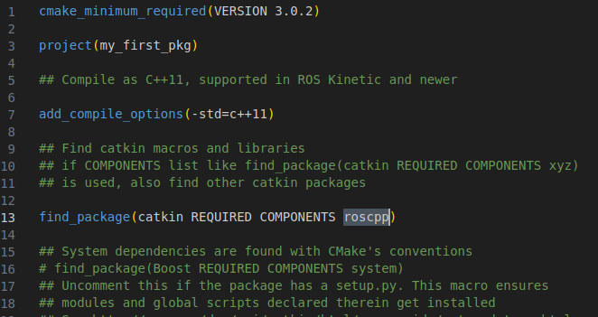
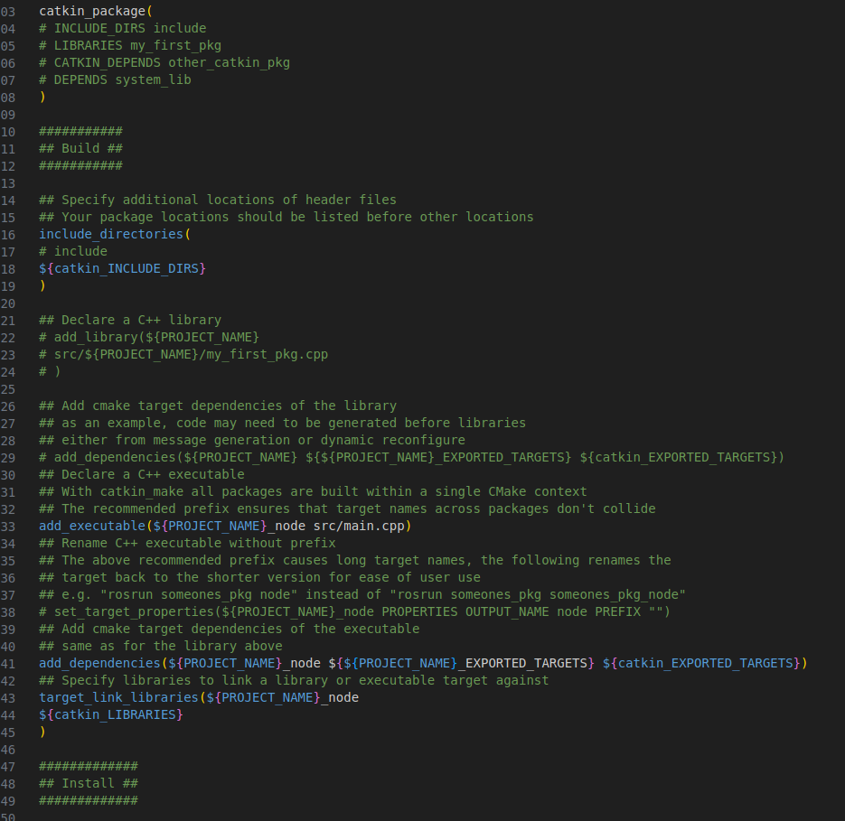
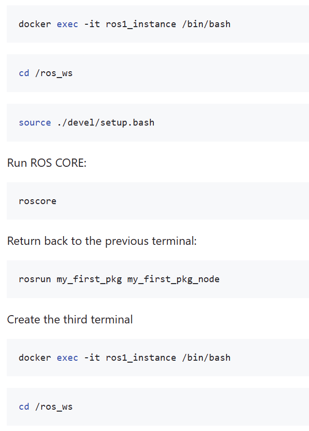
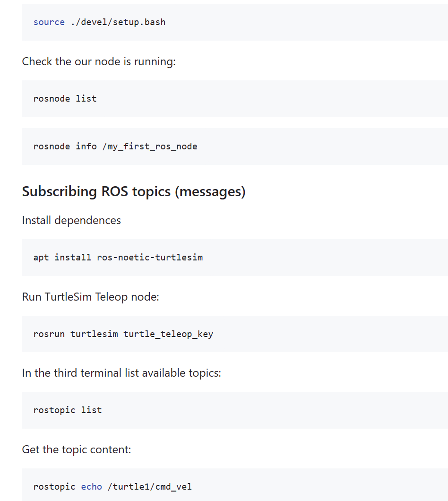
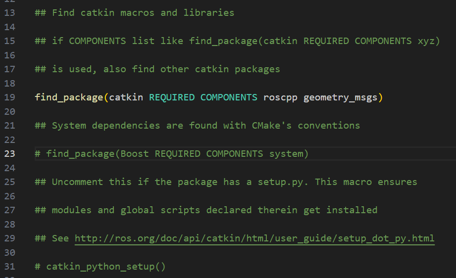
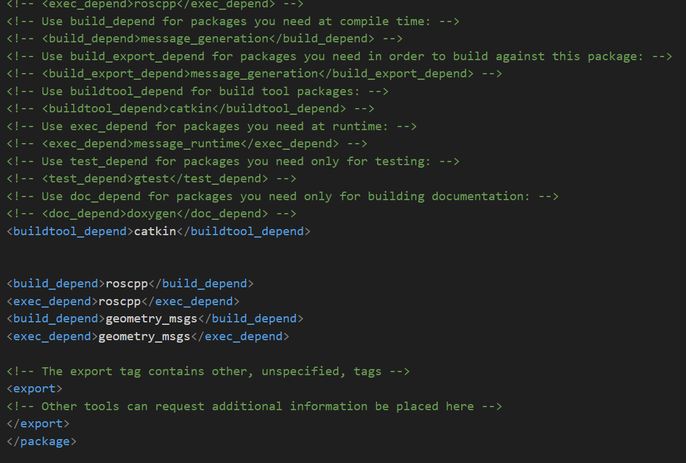

# ROS1 praktiskā nodarbība.

### Datora sagatavošana darbam 
1. Docker Desktop instalācija. 
2. Visual Studio Code instalācija, vai Notepad++.

### ROS1 docker image konteinera palaišana 

Palaišana ar nosacījumu kā datora lokālā direktorija ir koplietota ar konteinera workspace/src mapi.


Run container (Linux/Mac):

```bash 
docker run -d -it --name ros1_instance --mount type=bind,source="$(pwd)",target=/ros_ws/src ros:noetic-ros-core-buster /bin/bash
```

or

Run container (Windows):

```bash 
docker run -d -it --name ros1_instance --mount type=bind,source="${pwd}",target=/ros_ws/src ros:noetic-ros-core-buster /bin/bash
```

Pievienoties konteinerim


```bash  
apt install python3-rosdep-modules python3-rosinstall-generator python3-vcstools python3-vcstool build-essential -y
```


### Write your first code for ROS EDIT main.cpp by using your editor:

```cpp
#include <ros/ros.h>

int main(int argc, char** argv)

{

// Initialize a ROS node

ros::init(argc, argv, "my_first_ros_node");

// Create a ROS NodeHandle object

ros::NodeHandle n;

// wait until ROS is OK

while (ros::ok()) {

// Handle ROS communication events

ros::spinOnce();

ROS_INFO_ONCE( "My node is running" );

}

return 0;

}
```


### EDIT CMAKELISTS package file:



...



### EDIT package.xml file:

```xml
<?xml version="1.0"?>
<package format="2">
<name>my_first_pkg</name>
<version>0.0.0</version>
<description>The my_first_pkg package</description>

<!-- One maintainer tag required, multiple allowed, one person per tag -->
<!-- Example: -->
<!-- <maintainer email="jane.doe@example.com">Jane Doe</maintainer> -->
<maintainer email="root@todo.todo">root</maintainer>


<!-- One license tag required, multiple allowed, one license per tag -->
<!-- Commonly used license strings: -->
<!-- BSD, MIT, Boost Software License, GPLv2, GPLv3, LGPLv2.1, LGPLv3 -->
<license>TODO</license>


<!-- Url tags are optional, but multiple are allowed, one per tag -->
<!-- Optional attribute type can be: website, bugtracker, or repository -->
<!-- Example: -->
<!-- <url type="website">http://wiki.ros.org/my_first_pkg</url> -->


<!-- Author tags are optional, multiple are allowed, one per tag -->
<!-- Authors do not have to be maintainers, but could be -->
<!-- Example: -->
<!-- <author email="jane.doe@example.com">Jane Doe</author> -->


<!-- The *depend tags are used to specify dependencies -->
<!-- Dependencies can be catkin packages or system dependencies -->
<!-- Examples: -->
<!-- Use depend as a shortcut for packages that are both build and exec dependencies -->
<!-- <depend>roscpp</depend> -->
<!-- Note that this is equivalent to the following: -->
<!-- <build_depend>roscpp</build_depend> -->
<!-- <exec_depend>roscpp</exec_depend> -->
<!-- Use build_depend for packages you need at compile time: -->
<!-- <build_depend>message_generation</build_depend> -->
<!-- Use build_export_depend for packages you need in order to build against this package: -->
<!-- <build_export_depend>message_generation</build_export_depend> -->
<!-- Use buildtool_depend for build tool packages: -->
<!-- <buildtool_depend>catkin</buildtool_depend> -->
<!-- Use exec_depend for packages you need at runtime: -->
<!-- <exec_depend>message_runtime</exec_depend> -->
<!-- Use test_depend for packages you need only for testing: -->
<!-- <test_depend>gtest</test_depend> -->
<!-- Use doc_depend for packages you need only for building documentation: -->
<!-- <doc_depend>doxygen</doc_depend> -->
<buildtool_depend>catkin</buildtool_depend>


<build_depend>roscpp</build_depend>
<exec_depend>roscpp</exec_depend>


<!-- The export tag contains other, unspecified, tags -->
<export>
<!-- Other tools can request additional information be placed here -->

</export>
</package>
```

### Compile the project from the workspace directory:

```bash
catkin_make
```


### RUN the new package node:

Open a new terminal for the docker container:






Return to the prev.terminal and play with keyboard arrows…

### Modify your package main.cpp file.

Define the class
```cpp
class My_subscriber
{
public:
    My_subscriber(ros::NodeHandle* nh) { // the class's constructor
    nh_ = nh;
    sub_ = nh_->subscribe("/cmd", 100, &My_subscriber::topic_callback, this);
    ROS_INFO( "My_subscriber is listening /cmd topic" );
    }

private:
    void topic_callback(const geometry_msgs::Twist::Ptr msg) {
        // Printing out the message content
        ROS_INFO_STREAM("Catch message: linear.x=" << msg->linear.x <<
                        ", linear.y="<< msg->linear.y <<
                        ", linear.z="<< msg->linear.z <<
                        ", angular.x="<< msg->angular.x <<
                        ", angular.y="<< msg->angular.y <<
                        ", angular.z="<< msg->angular.z);
        }

    ros::Subscriber sub_;
    ros::NodeHandle* nh_;
};
```

Use additional include:

```cpp
#include <geometry_msgs/Twist.h>
```

Full source of the main.cpp

```cpp
#include <ros/ros.h>
#include <geometry_msgs/Twist.h>

class My_subscriber
{
public:
    My_subscriber(ros::NodeHandle* nh) { // the class's constructor
    nh_ = nh;
    sub_ = nh_->subscribe("/cmd", 100, &My_subscriber::topic_callback, this);
    ROS_INFO( "My_subscriber is listening /cmd topic" );
}

private:
    void topic_callback(const geometry_msgs::Twist::Ptr msg) {
    // Printing out the message content
    ROS_INFO_STREAM("Catch message: linear.x=" << msg->linear.x <<
                    ", linear.y="<< msg->linear.y <<
                    ", linear.z="<< msg->linear.z <<
                    ", angular.x="<< msg->angular.x <<
                    ", angular.y="<< msg->angular.y <<
                    ", angular.z="<< msg->angular.z);
    }

    ros::Subscriber sub_;
    ros::NodeHandle* nh_;
};

int main(int argc, char** argv)
{

    // Initialize a ROS node
    ros::init(argc, argv, "my_first_ros_node");

    // Create a ROS NodeHandle object
    ros::NodeHandle n;

    // Create our class's instance
    My_subscriber topic_subscr(&n);

    // wait until ROS is OK
    while (ros::ok()) {
        
        // Handle ROS communication events
        ros::spinOnce();
        ROS_INFO_ONCE( "My node is running" );
    }

return 0;

}
```

### Modify the CMAKELIST file of the package



### Modify the package.xml file for the package


<!-- Other tools can request additional information be placed here -->
</export>
</package>

### Make the project

```bash
catkin_make
```

Run in 3 separate terminals:

```bash
roscore
```
 
```bash
rosrun turtlesim turtle_teleop_key
```
 
```bash
rosrun my_first_pkg my_first_pkg_node /cmd:=/turtle1/cmd_vel
```

! /cmd:=/turtle1/cmd_vel ir topic remap pieeja, kas ļauj node ietvaros no roscore redzēt topic /turtle1/cmd_vel ar citu iekšējo nosaukumu /cmd.


## ROS topic Publisher

Veidojam otro mūsu pakotni ar nosaukumu “my_second_package”, līdzīgi kā pirmo, bet ar jauno nosaukumu.

Jaunajā pakotnē izveidojam main.cpp failu pakotnes src mapē.

Full source of the main.cpp for the second package.
```
#include <ros/ros.h>

#include <geometry_msgs/Twist.h>

class My_publisher

{

public:

My_publisher(ros::NodeHandle* nh) { // the class's constructor

nh_ = nh;

pub_ = nh_->advertise<geometry_msgs::Twist>("/cmd", 100);

ROS_INFO( "My_publisher is ready" );

}

void run() {

// create a new message

geometry_msgs::Twist cmd_msg;

// provide values

cmd_msg.linear.x = 0.0;

cmd_msg.linear.y = 1.0;

cmd_msg.linear.z = 0.0;

cmd_msg.angular.x = 0.0;

cmd_msg.angular.y = -2.0;

cmd_msg.angular.z = 0.0;

// publish the message

pub_.publish(cmd_msg);

}

private:

ros::Publisher pub_;

ros::NodeHandle* nh_;

};

int main(int argc, char** argv)

{

// Initialize a ROS node

ros::init(argc, argv, "my_first_ros_node");

// Create a ROS NodeHandle object

ros::NodeHandle n;

// Create our class's instance

My_publisher cmd_topic_publisher(&n);

// use ROS time to publish messages with a frequency, for example 2 Hz

ros::Rate r(2);

// wait until ROS is OK

while (ros::ok()) {

// Handle ROS communication events

ros::spinOnce();

r.sleep(); // make a delay accordingly to the frequency

cmd_topic_publisher.run();

ROS_INFO_ONCE( "My node is running" );

}

return 0;

}
```

Compile all

```bash
catkin_make
```

RUN:

```bash
roscore
```

```bash
rosrun my_second_package my_second_package_node
```

```bash
rosrun my_first_pkg my_first_pkg_node
```

Roslaunch izmantošana

Otrajā pakotnē izveidot mapi ar nosaukumu ‘launch’

```bash
mkdir ./launch
```

```bash
cd ./launch
```

Izveidot tukšo failu ‘run_all.launch’

```bash
touch ./run_all.launch
```

Aizpildīt ar šādu saturu:
```
<launch>

<!-- Run the first package -->

<node name="first_pgk" type="my_first_pkg_node" pkg="my_first_pkg" output="screen">

</node>

<!-- Run the second package -->

<node name="second_pgk" type="my_second_package_node" pkg="my_second_package" output="screen">

</node>

</launch>
```

Run all in the command line:

```bash
roslaunch my_second_package run_all.launch
```